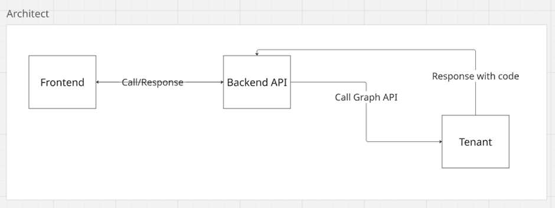

# PreScan Readiness

## Purpose
PreScan Readiness is a pre-check step before running a Microsoft 365 compliance scan.

Its purpose is to help the user understand whether the selected tenant connection is ready enough to scan before the real scan starts.

This improves the user experience by warning early about likely permission or authentication issues instead of only discovering them during scan execution.

## Problem Solved
Before this feature:
- a user could start a scan with an incomplete or incorrectly permissioned tenant connection
- the scan could stay pending, move slowly, or fail later in the worker
- the user had no early signal that the environment was not ready
- this wasted time and made AutoAudit feel unreliable for first-time users

This feature solves that by running a lightweight readiness check before the scan.

## What It Checks
PreScan Readiness focuses on the selected M365 connection and the selected benchmark.

It checks:

1. The saved M365 app credentials can authenticate successfully.
2. A Microsoft Graph access token can be acquired.
3. The permissions declared in benchmark `metadata.json` for controls marked as `ready` can be probed.
4. A small baseline set of critical permissions is also checked:
   - `Organization.Read.All`
   - `User.Read.All`
   - `RoleManagement.Read.Directory`

The required permissions are read from benchmark metadata, mainly from:

- `engine/policies/{framework}/{benchmark}/{version}/metadata.json`

The backend collects `requires_permissions` only from controls where:

- `automation_status == "ready"`

This keeps readiness aligned with the subset of controls that the scan engine is expected to run.

## Current Scope and Known Gaps
PreScan Readiness is intentionally lightweight.

Today it is strongest for Microsoft Graph-based permission checks, but it does not yet cover every permission path used by the scan engine.

Known gaps to call out:

- some permissions declared in benchmark metadata are not yet directly probed by readiness
- this is especially relevant for Exchange Online PowerShell-heavy connectivity and some Entra governance or device-management collectors
- examples currently called out in review are:
  - `Exchange.Manage`
  - `DeviceManagementConfiguration.Read.All`
  - `AccessReview.Read.All`
  - `AuditLog.Read.All`

This does not mean every benchmark needs all of these permissions.

Different benchmarks and different controls use different collectors, so the exact permission set depends on what the user is planning to run.

Because of that, the current readiness result should be treated as an early pre-check, not a full guarantee that every runtime permission path has been verified.

Future improvement:

- expand direct probe coverage for missing declared permissions
- better scope readiness checks to the exact benchmark and control set the user intends to run
- improve coverage for PowerShell-backed checks as well as Graph-based checks

## Outcome
PreScan Readiness returns one of three practical outcomes:

- `Ready`
  - all critical checks passed
  - scan can start without warning

- `Ready with warnings`
  - no critical failure, but some permissions are unverified or non-critical checks warned
  - scan can still start, but user is warned

- `Not Ready`
  - authentication failed, token acquisition failed, or critical permission checks failed
  - scan can still start if the user chooses to continue, but the UI warns about potential stuck, pending, or failed scan behavior

## Plan / Approach
The feature was implemented as a simple pre-flight validation between the frontend scan form and the actual scan engine.

Approach:
1. User selects an M365 connection and benchmark in the scan form.
2. Frontend calls a readiness endpoint before scan start.
3. Backend loads:
   - the saved M365 connection
   - the selected benchmark metadata
4. Backend extracts the declared permissions needed for ready controls.
5. Backend validates the connection and probes Microsoft Graph.
6. Backend returns a simple readiness result.
7. Frontend shows the result and warns the user when needed.

## Solution Diagram

## Implementation Summary
Main implementation files:

- `frontend/src/pages/Scans/ScansPage.tsx`
  - adds the readiness UI
  - adds `Run Readiness Check`
  - shows pass / warn / fail status
  - warns the user before starting a scan when readiness was not run or did not fully pass

- `frontend/src/api/client.ts`
  - adds the frontend call to `GET /v1/scans/readiness`

- `backend-api/app/api/v1/scans.py`
  - adds the readiness endpoint
  - loads connection and benchmark metadata
  - calls the readiness service

- `backend-api/app/services/scan_readiness.py`
  - contains the main readiness logic
  - extracts declared permissions
  - validates connection
  - probes Microsoft Graph
  - builds the response for the UI

- `backend-api/app/schemas/scan.py`
  - defines the readiness response shape

## Notes
- PreScan Readiness is not the real scan.
- It is a lightweight pre-check before the worker starts.
- It mainly validates authentication and required Microsoft Graph permissions.
- It uses benchmark metadata as the permission source of truth.
- It does not yet verify every permission path used by every collector.
- It improves usability by warning early and reducing avoidable failed scan attempts.
